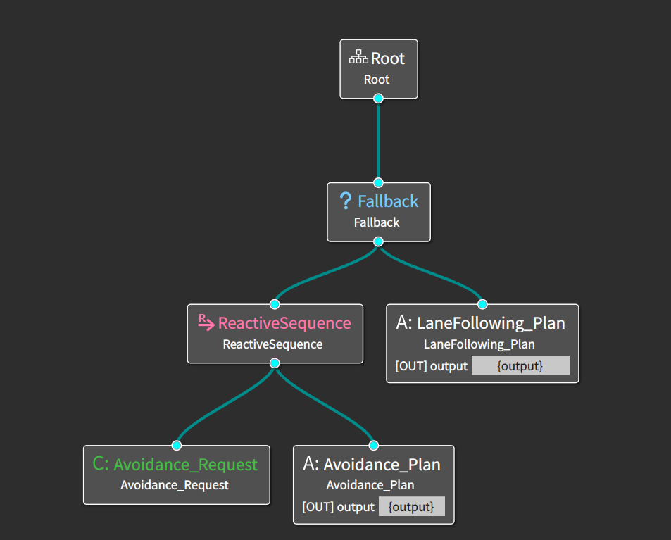
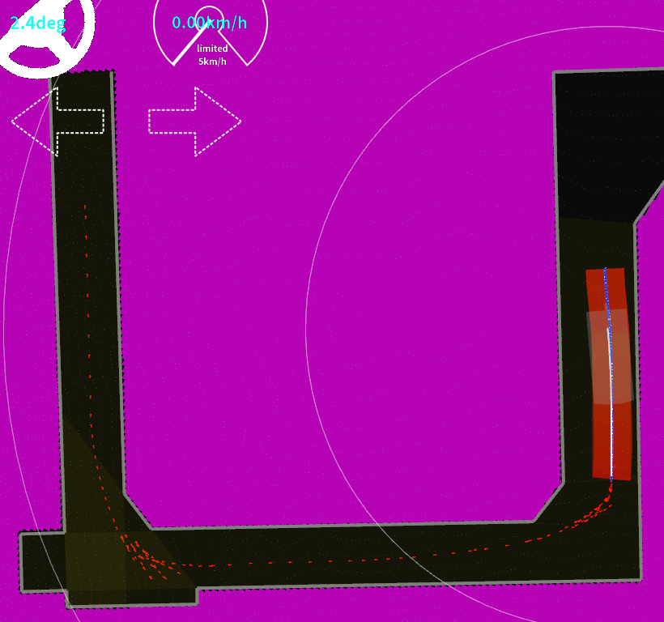

# WIP:aichallenge2023-integration-final
2023年に開催された自動運転AIチャレンジ(Integration)のチームiASLのソースコードです。

決勝はprodブランチです。
 
## 決勝を終えて
実環境とシミュレーター環境の違いをつくづく実感した大会でした。 
ここまで自己位置推定が狂ってしまうとは考えてもいなかったです。 
自分達のコードが試験走行の際に動作するのを見た際には大きなやりがいを感じました。

## コード概要
全体的にパラメータはかなり改変しました(特に制御・Planning)。 
MPC・PIDにおいては精密なコントロールのためソースコードの変更を少々行っています。<br?
Path-PlanningにおいてはBT-Tree・Paramの変更により起動するモジュールの制限も行いました。 
最後のS字はFreeSpacePlannerを改変し、A*とReeds sheppを用いてバック・ドライブの切り返しで乗り越えようとしていました。 
RViZにおいては各モジュールの可視化に注力しています。 
段ボール検知は途中でCenterPointからEuclidean Clusteringに変更しています。

### Control
#### PID
Target速度・加速度と現在の速度・加速度との差が小さくなるようにチューニングしました。 
最後のS字で切り返しを行う予定であったので、指定されたWaypointに正確に発着できるようにチューニングしました。
StoppingとStoppedの移行判定のソースコードをより柔軟になるよう改変しています。
#### MPC
Waypointと自車両の差(LatError,YawError)を減らすようにチューニングしました。 
それぞれの重みを上げすぎるとQP-Solverが解けなくなってしまうので、重み付けは慎重に行いました。
QP-SolverはOSQPと比較してUnconstraint-fastの方が安定して解を算出してくれました。
### Planning
後段モジュールのControlにて緻密に制御(着発進)するためにWayPointを増やしました。 
ダンボール回避は主にBehavior Path Planningで回避し、MotionPlanningで最後の最適化を行いました。 
### Behavior Path Planning
各モジュールを管理するBT-Treeを改変し、AvoidanceとLaneFollowingのみ機能するように変更しました。

### FreeSpacePlanner
今大会の道幅の狭いクランクを突破するためにAutoware標準のFreeSpaceプランナーを使用することで解決しようと試みました。
きれいな経路を生成こそしたのですが、シュミレーター上でも後ろタイヤの一部分やボディがはみ出る等コースアウトになってしまいました。
また、ソースコードを直に改変しました。詳しい概要は[こちら](./assets/docs/freespace.md)

### Perception
予選ではCenterPointを用いていましたが本番環境ではCenterPointを用いるためのGPUリソースが十分でなかったため,Euclidean Clusteringに変更しました。
### Localizer
試走会では自己位置の推定に問題がなかったため、ほぼデフォルト値でした。 
(これが本番に良くなかった？のですが、、)
地面から数十センチのPointCloudはNDP-Matchingに入力しないという設定にデフォルトから変更していました。 
また並列処理のThread数を増やしました。
### RViZ
制御・Planningのチューニングをより簡便にするために
Float32MultiArrayStampedPieChartでデータの可視化を行いました。

### Others
Autowareの各所にあるValidatorのモジュールを外しました。 
(これも本番に良くなかったのですが、)
