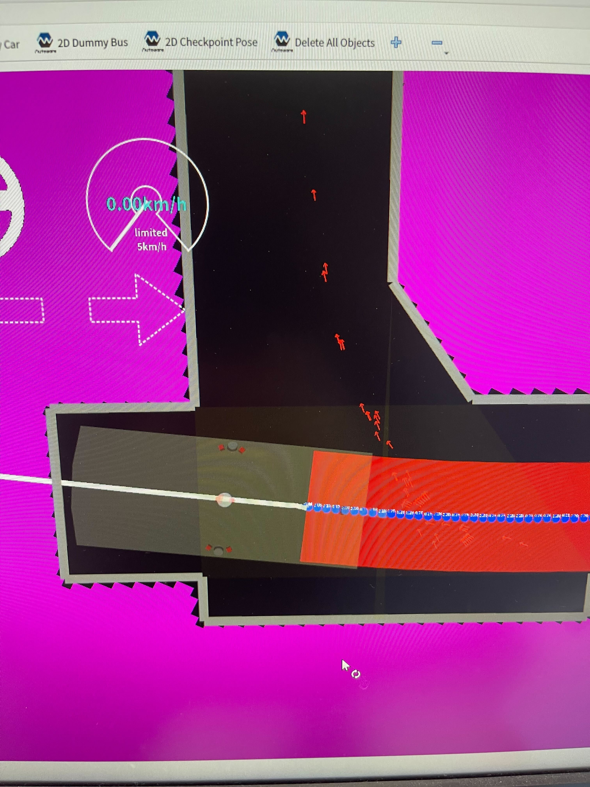

# Freespaceの詳細について
autowareのfreespace plannerに遷移するための条件は以下のようになっていました。
1. ゴールまでの距離
2. 一定時間車両速度が規定値以下
3. parking lot内にいるか

この条件から2を消すことで、規定範囲に入り次第フリースペースを起動することにしました。

その他、基本のアルゴリズムをhybrid a-starを選択しました。

人が運転しているのと同じように複数回切り返しするように設定しましたが、細かすぎて車両が動かない問題があったため、しきい値以上進まないと切り返ししないなどコードを変更したりしました。
